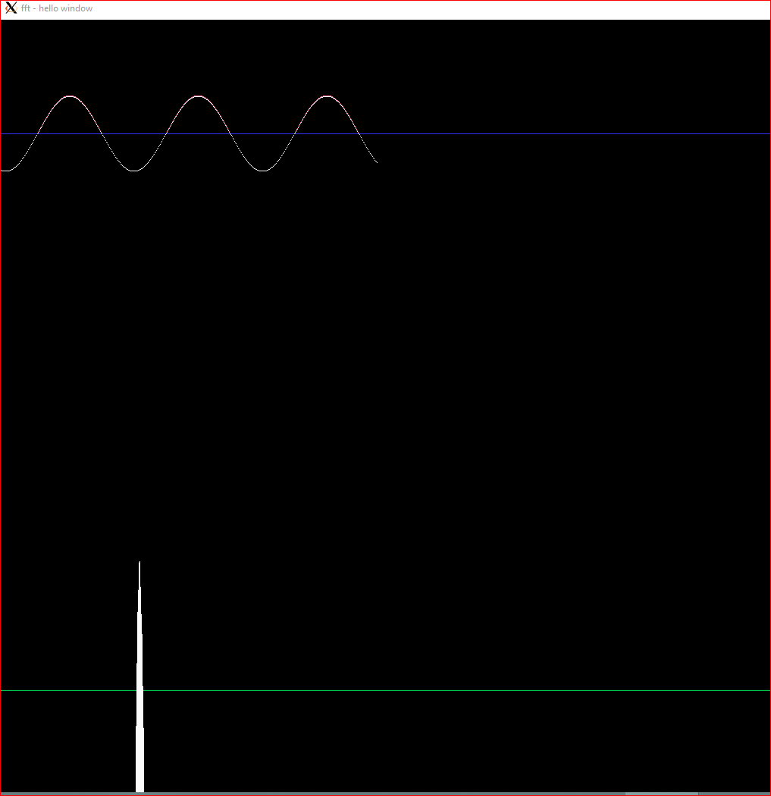

# work in progress | prototype phase



# latest commit:

```
feature: fft implemented
prob: frequency leak

test: libgraph vs gfx

todo: decide homogeneous range for values

fix: real and imaginary integration todo graph: decide lib + interaction + display info
```
